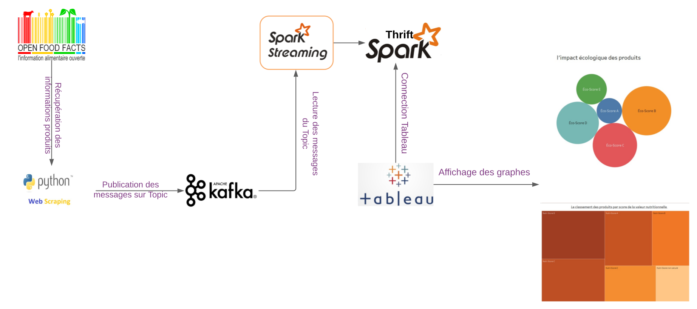

# Context
L'idée derrière le projet est de mettre en place une architecture temps réel avec visualisation des données: Kafka, Spark et Tableau. Nous avons pris comme source de données les information des produits du site [Open Food](https://fr.openfoodfacts.org/). Ces données seront publiées sur un topic Kafka qui seront, à leurs tours, consommées par Spark via le module le [Spark Structured Streaming](https://spark.apache.org/docs/latest/structured-streaming-programming-guide.html)

Dans ce cas de fugure, nous avons opté pour l'utilisation des données OpenFood, pour pouvoir les publier sur Kafka, l'alternative serait d'adapter les codes sources pour pouvoir consommer des messages sur des topics Kafka publics comme Tweeter.

# Architecture
Le shéma ci-dessous donne l'architecture de la solution:

# Requirement
L'environnement Linux/Mac est souhaitable. Pour windows, veuillez installer WSL2 et Ubuntu [ici](https://docs.microsoft.com/fr-fr/windows/wsl/install-win10#:~:text=Pour%20mettre%20%C3%A0%20jour%20vers,pas%20en%20charge%20WSL%202.)

# Installation
Le projet necessite les packages suivants:
- Pyspark: Suivre l'installation du [ici](https://www.osradar.com/install-apache-spark-debian-10/). Pour la section installation de la version Pyspark, il faudrait installer la derniere version disponible [3.2.1](https://archive.apache.org/dist/spark/spark-3.1.2/spark-3.1.2-bin-hadoop2.7.tgz) au lieu de [3.0.2](c https://archive.apache.org/dist/spark/spark-3.0.2/spark-3.0.2-bin-hadoop2.7.tgz).
  
- Kafka: Suivre l'installation du [ici](https://kafka.apache.org/quickstart)
- L'ensemble des packages necessaires pour le script du scraping: Selenium, Multiprocessing.....
- Tableau et Pyspark thrift connector : Installer Tableau [ici](https://www.tableau.com/fr-fr/support/releases).Pour connecter Tableau à Pyspark le connector `Thrift` est nécessaire. Pour cela? veuillez suivre le [blog](https://www.tableau.com/fr-fr/support/releases).

# Start-up:

## Kafka
Dans un premier temps, il faudrait lancer un cluster Kafka: Zookeeper et le serveur, puis créer un Topic.

- Zookeeper: `/opt/kafka_2.13-2.8.0/bin/zookeeper-server-start.sh  /opt/kafka_2.13-2.8.0/config/zookeeper.properties &`
- Serveur: `/opt/kafka_2.13-2.8.0/bin/kafka-server-start.sh /opt/kafka_2.13-2.8.0/config/server.properties &`
- Création d'un topic : `/opt/kafka_2.13-2.8.0/bin/kafka-topics.sh --create --topic products-events --bootstrap-server localhost:9092 &`. Le nom du topic doit être respecté `products-events`

## Pyspark
On aura besoin de démarrer le cluster Pyspark contanant un master et un slave
- Master: `/opt/spark-3.1.2/sbin/start-master.sh`. Une fois exécutée, on aura le fichier log qui permet la récuperation du nom du master. Le fichier peut être lu avec `tail -f fichier.out` Remplacer fihcier par le nom de votre fichier log. En l'occurence, ce log `Starting Spark master at` permet de récuperer le nom du master. Ensuite, on y reférera par le nom suivant `spark://<MYDESKTOP>.localdomain:7077`
- Slave: `start-slave.sh spark://<MYDESKTOP>.localdomain:7077 --cores 2 &`, on attribue uniquement deux CPU au slave.
  
## Producer/Consumer des messages
Nous avon mis en place un script permettant de scrapper le site [Open Food](https://fr.openfoodfacts.org/).
Nous récupérons les informations des produits et nous les publions dans le topic Kafka `products-events`.
- `python3.8 Open-food.py &`

Une fois que le script du producer est lancé, nous lançons le script consumer dans Pyspark.
- `spark-submit --packages org.apache.spark:spark-sql-kafka-0-10_2.12:3.1.2 Pyspark-consumer.py > streaming.log &`. Nous lançons le script Pyspark par la commande submit, nous rajoutons des dépendances via `--packages` pour installer le package Kafka Sql, afin de pouvoir utiliser Pyspark Structured Streaming avec Kafka.
  
## Dataviz aevc Tableau 
- Une fois le script consumer lancé, nous pouvons lancer Tableau pour le connecter à Pyspark.
- La configuration de tableau utilisera l'adresse IP du master Pyspark visible dans ses logs, ecoutera sur le port `10000`.
- Les graphes sont disponibles sous le repertoire `charts`qui sont diponibles via le `Data-viz.twb`. Vous devrez créer une source de données utilisant le schema `default` puis de créer une nouvelle requête `SELECT * FROM Products`. Vouez pourriez après visualiser les graphes. 
